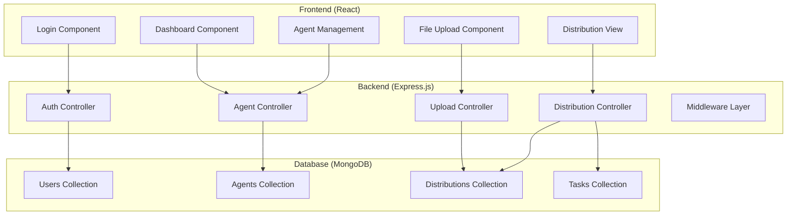

# Design Document

## Overview

The MERN Agent Management System is a full-stack web application that enables admin users to manage agents and distribute CSV-based task lists. The system follows a traditional three-tier architecture with React frontend, Express.js API backend, and MongoDB database. The application implements JWT-based authentication, file upload processing, and automated task distribution algorithms.

## Architecture

### System Architecture



### Technology Stack

- **Frontend**: React.js with functional components and hooks
- **Backend**: Node.js with Express.js framework
- **Database**: MongoDB with Mongoose ODM
- **Authentication**: JSON Web Tokens (JWT)
- **File Processing**: Multer for uploads, xlsx/csv-parser for parsing
- **Validation**: Joi for backend validation, React Hook Form for frontend
- **Styling**: CSS modules or styled-components

## Components and Interfaces

### Frontend Components

#### Authentication Components
- **LoginForm**: Handles user authentication with email/password validation
- **ProtectedRoute**: HOC for route protection using JWT verification
- **AuthContext**: React context for managing authentication state

#### Core Application Components
- **Dashboard**: Main landing page showing system overview and navigation
- **AgentManagement**: CRUD interface for agent operations
- **FileUpload**: Drag-and-drop interface for CSV/Excel file uploads
- **DistributionView**: Display interface for viewing agent task assignments
- **AgentDetail**: Detailed view of individual agent's assigned tasks

#### Utility Components
- **ErrorBoundary**: Global error handling component
- **LoadingSpinner**: Reusable loading indicator
- **NotificationToast**: User feedback for operations

### Backend API Endpoints

#### Authentication Routes
```
POST /api/auth/login
- Body: { email, password }
- Response: { token, user }
```

#### Agent Management Routes
```
GET /api/agents
- Response: [{ id, name, email, mobile, createdAt }]

POST /api/agents
- Body: { name, email, mobile, password }
- Response: { id, name, email, mobile }

GET /api/agents/:id
- Response: { id, name, email, mobile, assignedTasks }

PUT /api/agents/:id
- Body: { name, email, mobile }
- Response: { id, name, email, mobile }

DELETE /api/agents/:id
- Response: { message }
```

#### File Upload and Distribution Routes
```
POST /api/upload
- Body: FormData with file
- Response: { distributionId, summary }

GET /api/distributions
- Response: [{ id, filename, totalItems, createdAt }]

GET /api/distributions/:id
- Response: { id, filename, agents: [{ agentId, tasks }] }

GET /api/agents/:id/tasks
- Response: [{ firstName, phone, notes }]
```

### Middleware Components

#### Authentication Middleware
```javascript
const authenticateToken = (req, res, next) => {
  // JWT verification logic
  // Attach user to request object
}
```

#### File Upload Middleware
```javascript
const uploadMiddleware = multer({
  storage: multer.memoryStorage(),
  fileFilter: (req, file, cb) => {
    // Validate file types: csv, xlsx, xls
  },
  limits: { fileSize: 5 * 1024 * 1024 } // 5MB limit
})
```

#### Error Handling Middleware
```javascript
const errorHandler = (err, req, res, next) => {
  // Centralized error handling
  // Log errors and return user-friendly messages
}
```

## Data Models

### User Model (MongoDB Schema)
```javascript
{
  _id: ObjectId,
  email: String (required, unique),
  password: String (required, hashed),
  role: String (default: 'admin'),
  createdAt: Date,
  updatedAt: Date
}
```

### Agent Model (MongoDB Schema)
```javascript
{
  _id: ObjectId,
  name: String (required),
  email: String (required, unique),
  mobile: {
    countryCode: String (required),
    number: String (required)
  },
  password: String (required, hashed),
  isActive: Boolean (default: true),
  createdAt: Date,
  updatedAt: Date
}
```

### Distribution Model (MongoDB Schema)
```javascript
{
  _id: ObjectId,
  filename: String (required),
  originalName: String (required),
  totalItems: Number (required),
  uploadedBy: ObjectId (ref: 'User'),
  createdAt: Date,
  status: String (enum: ['processing', 'completed', 'failed'])
}
```

### Task Model (MongoDB Schema)
```javascript
{
  _id: ObjectId,
  distributionId: ObjectId (ref: 'Distribution'),
  agentId: ObjectId (ref: 'Agent'),
  firstName: String (required),
  phone: String (required),
  notes: String,
  status: String (enum: ['assigned', 'completed'], default: 'assigned'),
  assignedAt: Date,
  completedAt: Date
}
```

## Error Handling

### Frontend Error Handling
- **Network Errors**: Retry mechanism with exponential backoff
- **Validation Errors**: Real-time field validation with error messages
- **Authentication Errors**: Automatic token refresh or redirect to login
- **File Upload Errors**: Progress indication and error recovery options

### Backend Error Handling
- **Database Errors**: Connection retry logic and graceful degradation
- **File Processing Errors**: Detailed error messages for invalid formats
- **Authentication Errors**: Proper HTTP status codes and error descriptions
- **Validation Errors**: Field-specific error messages using Joi

### Error Response Format
```javascript
{
  success: false,
  error: {
    code: 'VALIDATION_ERROR',
    message: 'User-friendly error message',
    details: {
      field: 'Specific field error'
    }
  }
}
```

## Testing Strategy

### Unit Testing
- **Frontend**: Jest and React Testing Library for component testing
- **Backend**: Jest and Supertest for API endpoint testing
- **Database**: MongoDB Memory Server for isolated database testing

### Integration Testing
- **API Integration**: Test complete request/response cycles
- **File Upload Flow**: Test CSV parsing and distribution logic
- **Authentication Flow**: Test JWT generation and validation

### End-to-End Testing
- **User Workflows**: Cypress tests for complete user journeys
- **File Upload Process**: Test actual file uploads and distribution
- **Error Scenarios**: Test error handling and recovery

### Test Coverage Goals
- Minimum 80% code coverage for critical paths
- 100% coverage for authentication and security functions
- Comprehensive testing of file processing and distribution algorithms

## Security Considerations

### Authentication Security
- Password hashing using bcrypt with salt rounds
- JWT tokens with appropriate expiration times
- Secure HTTP-only cookies for token storage (optional enhancement)

### File Upload Security
- File type validation using magic numbers, not just extensions
- File size limits to prevent DoS attacks
- Virus scanning integration (future enhancement)
- Temporary file cleanup after processing

### Data Protection
- Input sanitization to prevent NoSQL injection
- Rate limiting on API endpoints
- CORS configuration for production deployment
- Environment variable protection for sensitive data

## Performance Optimization

### Frontend Optimization
- Code splitting for reduced initial bundle size
- Lazy loading of non-critical components
- Memoization of expensive calculations
- Optimized re-renders using React.memo and useMemo

### Backend Optimization
- Database indexing on frequently queried fields
- Connection pooling for MongoDB
- Caching of frequently accessed data
- Streaming for large file uploads

### File Processing Optimization
- Streaming CSV parsing for large files
- Background job processing for distribution
- Progress tracking for long-running operations
- Memory-efficient file handling

## Deployment Configuration

### Environment Variables
```
# Database
MONGODB_URI=mongodb://localhost:27017/agent-management
MONGODB_TEST_URI=mongodb://localhost:27017/agent-management-test

# Authentication
JWT_SECRET=your-super-secret-jwt-key
JWT_EXPIRES_IN=24h

# Server
PORT=5000
NODE_ENV=development

# File Upload
MAX_FILE_SIZE=5242880
UPLOAD_DIR=./uploads
```

### Production Considerations
- MongoDB Atlas for cloud database hosting
- PM2 for process management
- Nginx for reverse proxy and static file serving
- SSL/TLS certificate configuration
- Environment-specific configuration files